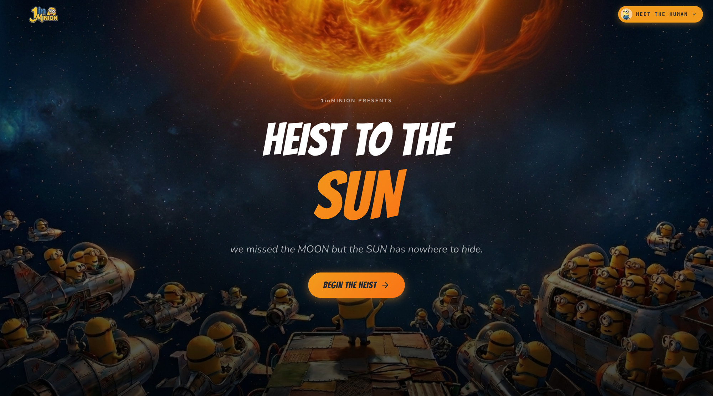
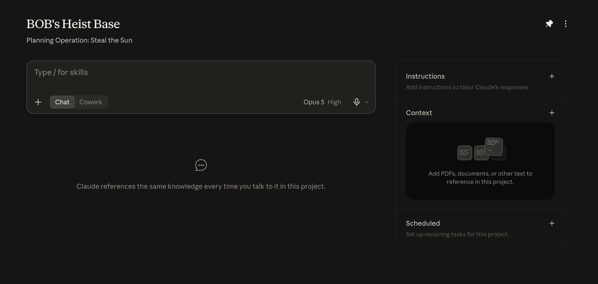
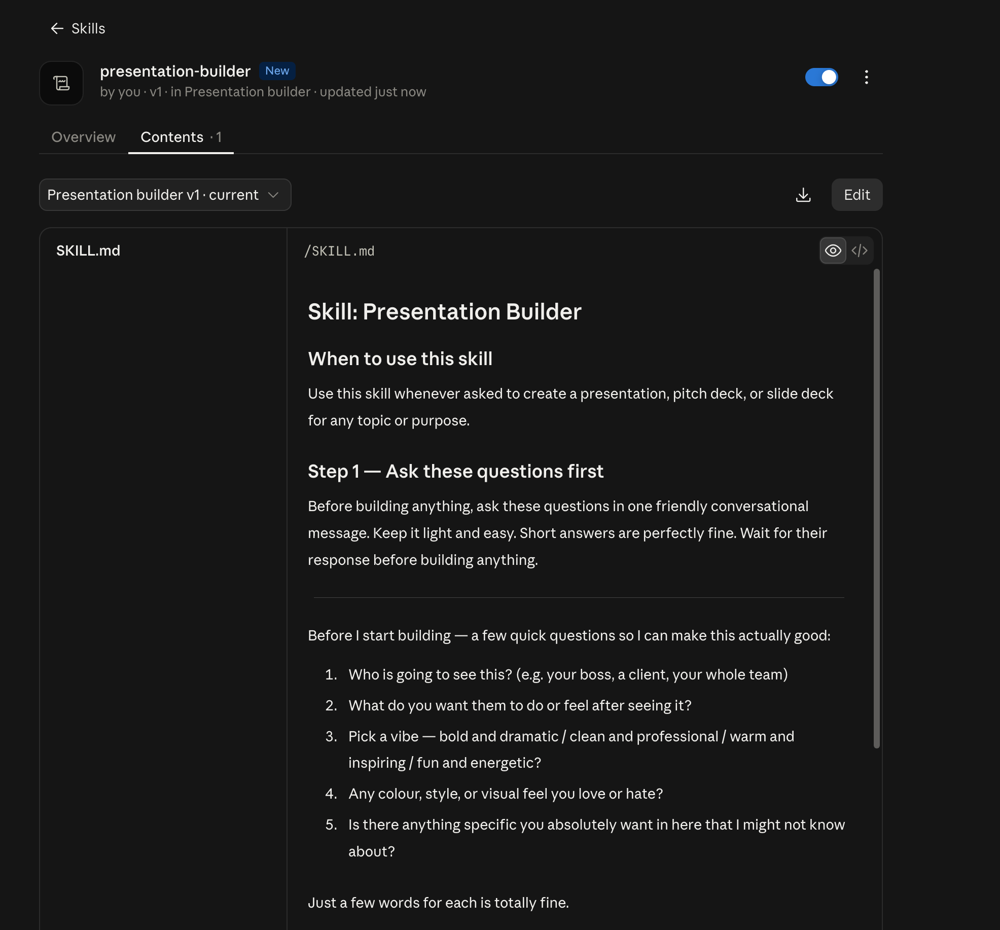
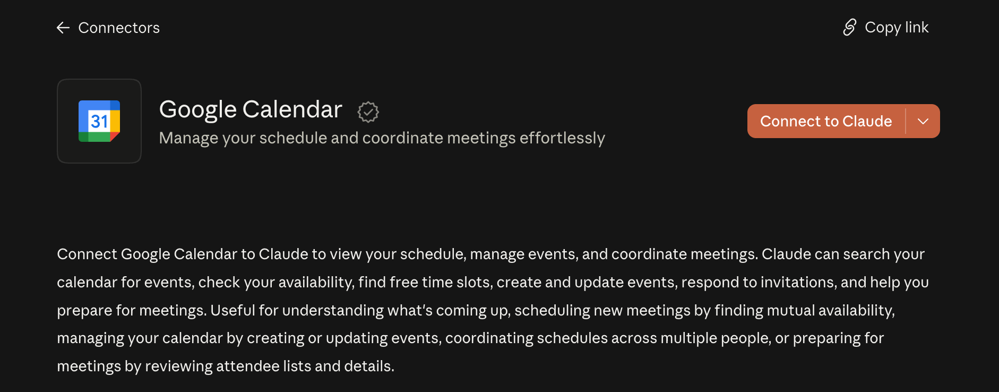

<div align="center">



# 1inMINION — Heist to the Sun

**A hands-on training experience that teaches non-technical teams how to actually use Claude.**

Four levels. Seventy minutes. One ridiculous mission.

### [→ Start the heist](https://1inminion.vercel.app/)

<sub>Free to run. You'll need a Claude account — the paid plan (around $20/month) unlocks Projects, Skills, and Connectors.</sub>

</div>

---

## What this is

Most AI training is a slide deck about what AI *could* do. This is the opposite. Learners
name their own AI Minion, then spend seventy minutes building it from a blank chat into
something that reads data, follows their method, and books a real meeting on their real
calendar.

The heist framing is a delivery mechanism. Every capability taught is one people take
straight back to their actual job on Monday.

Built for a workshop, then rebuilt so any team can run it.

## The four levels

| # | Level | Concept | What the learner does | Time |
|---|-------|---------|----------------------|------|
| 01 | Talk to Your Minion | **Prompt Engineering** | Runs a vague prompt, then builds a structured one a layer at a time — Task, Role, Context, Format, Constraints — and watches the answer improve at every step | 15 min |
| 02 | Arm Your Minion | **Projects** | Builds a Claude Project, loads instructions and 374 mission records into it once, then proves the memory works by asking a brand new chat what it already knows | 25 min |
| 03 | Upgrade Your Minion | **Skills** | Asks for a presentation, installs a Skill, asks for the identical thing again — and sees the same words produce completely different behaviour | 15 min |
| 04 | Give Minion the Wheel | **MCPs** | Connects Google Calendar, then gives one goal instead of a list of steps and watches the Minion act in the real world | 15 min |

Each level builds on the last. Levels 2 through 4 run in a single conversation, so by the
end the Minion is working from everything the learner built along the way.

<div align="center">

<br><em>Level 02 — Instructions is who your Minion is. Context is what it knows.</em>
</div>

## What learners walk away with

- A repeatable method for writing prompts that works with any AI tool
- A working Claude Project loaded with their own instructions and data
- A reusable Skill that produces a designed PowerPoint deck on demand
- A live tool connection, and a real understanding of what an AI agent actually is

<div align="center">

<br><em>Level 03 — a Skill is a method written down once, applied every time.</em>
</div>

## Making it yours

Fork it and the whole workshop becomes yours. All copy lives in `content/`, so you can
rewrite every level without touching a component.

```
content/
  landing.ts                       landing page and onboarding copy
  levels.ts                        the four level cards
  levels/levelN/
    level_0N_briefing.json         objectives, concepts, checklist
    level_0N_resources.json        prompts, downloads, links
public/files/
  minion_mission_data.csv          the 374-record dataset
  pitch_skill.md                   the Presentation Builder Skill
```

Swap the CSV for your own data, rewrite the five mission questions, and the whole thing
becomes a workshop about your work instead of a heist.

Progress is kept in the browser's `localStorage`, so there is no backend, no database, and
no accounts to manage.

<div align="center">

<br><em>Level 04 — the point where it stops answering and starts doing.</em>
</div>

## Built with

Next.js 14 (App Router) · TypeScript · Tailwind CSS · Framer Motion · lucide-react

Design tokens and component patterns are documented in [`DESIGN.md`](DESIGN.md). Project
structure and conventions are in [`CLAUDE.md`](CLAUDE.md).

## Notes

The *Despicable Me* theme is a fan-made framing used for teaching. Minion characters and
artwork belong to Universal / Illumination. Replace the imagery in `public/` before using
this commercially.

---

<div align="center">

Built by **Vanshaj Gupta**

[LinkedIn](https://www.linkedin.com/in/vanshajgupta/) · [Portfolio](https://vanshajgupta.com/)

</div>
